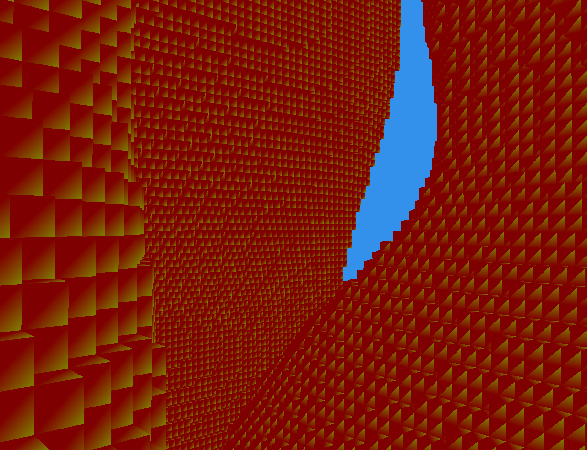

# Voxel Engine

A small C++ voxel renderer and engine prototype using GLFW, GLAD and GLM.  
Clean, modular codebase focused on clarity and learning — great for experimentation and extension.

Highlights
- Minimal, modern C++ (C++14) code organization.
- Uses [GLFW](lib/glfw) for windowing/input, [GLAD](lib/glad) for GL loading and [GLM](lib/glm) for math.
- Chunked voxel world and simple world generator.

Quick start

Prerequisites
- CMake 4.0+
- A C++14-capable compiler
- OpenGL development libraries

Build
```sh
mkdir build
cd build
cmake ..
cmake --build .
```
---

## Screenshot of the latest version
